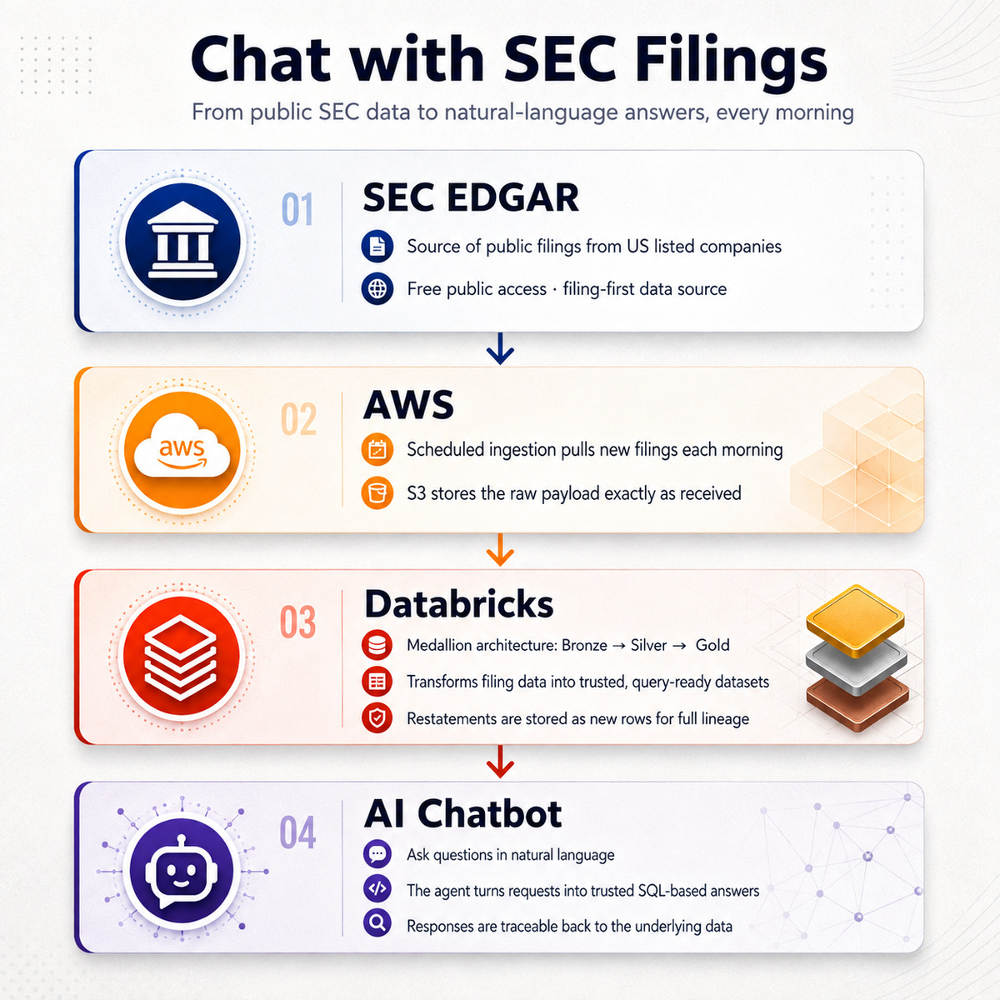
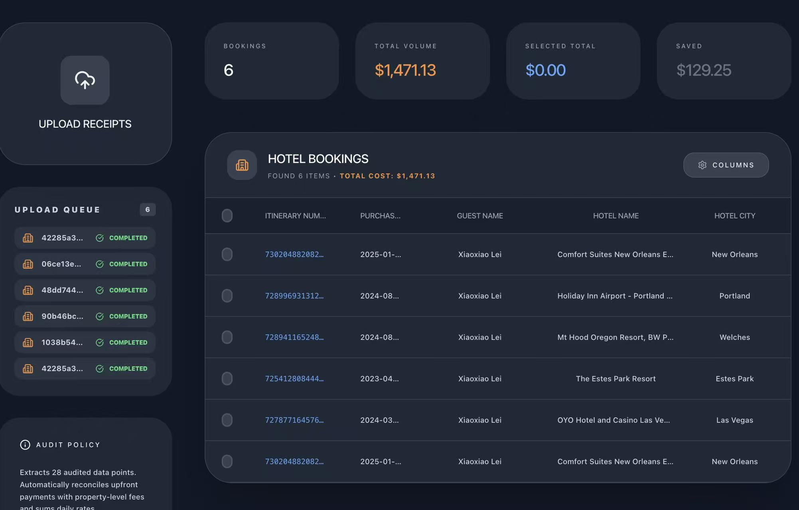
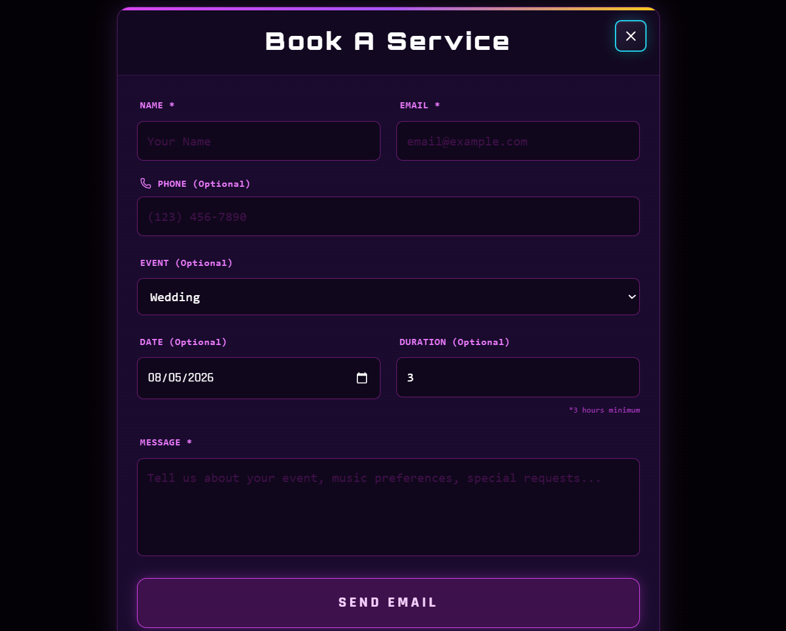
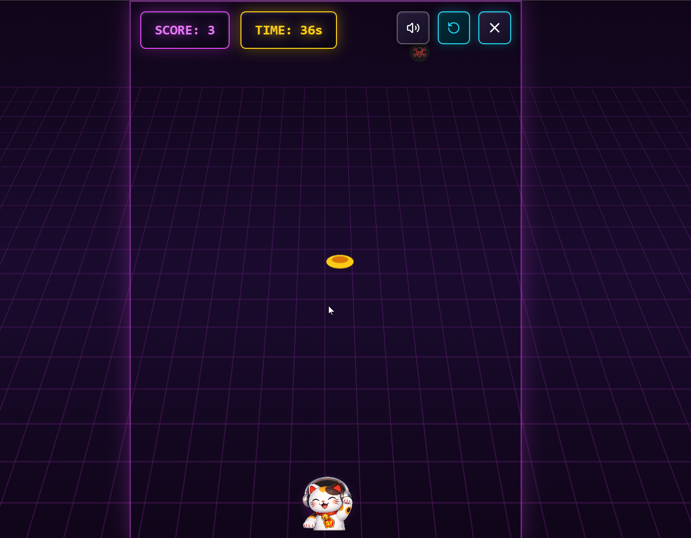
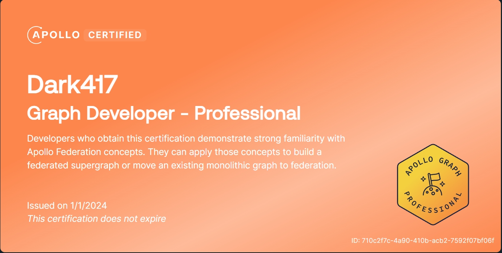

# Xiaoxiao Lei

## Resume

[Xiaoxiao Lei Resume](docs/Xiaoxiao_Lei_Resume.pdf)

## Projects

I'm updating for more projects..

- [Edgar](#edgar)
- [Fast Invoices](#fast-invoices)
- [DJ CASH CAT Personal Website](#dj-cash-cat-personal-website)

### Edgar

Chatbot with Edgar SEC filing data.

Databricks, AWS, AWS Bedrock, LangGraph, Claude Code

- Try it out: [https://edgar.xiaoxiaolei.com](https://edgar.xiaoxiaolei.com)
- See details at [Edgar Chatbot Repo](https://github.com/Dark417/1sde-edgar-06-chatbot)

### Fast Invoices

Upload Expedia receipts to get an expense summary in a spreadsheet.

GCP Cloud Run, Gemini API, Prompt Engineering

[Try Fast Invoices](https://fastreceipts-ui-881307731982.us-south1.run.app/)

### DJ CASH CAT Personal Website

Book a service or play a game to get a discount.

[Visit DJ CASH CAT](https://djcashcat-360588111852.us-south1.run.app/)

  
  
  

## Certifications

- [AWS Certified Developer - Associate](certificates/AWS%20Certified%20Developer%20-%20Associate%20certificate.pdf)

- [GraphQL Professional Certificate](certificates/GraphQL%20Professional%20Certificate.pdf)

## Publication

[**_MultiModal Language Modelling on Knowledge Graphs for Deep Video Understanding_**](https://doi.org/10.1145/3474085.3479220), Proceedings of the 29th ACM International Conference on Multimedia (**ACM Multimedia 2021**).
